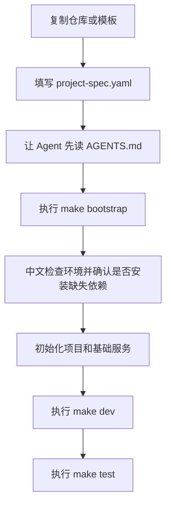

# Agent 可感知项目脚手架模板

[](https://img.shields.io/)
[](https://img.shields.io/)
[](https://img.shields.io/)
[](https://img.shields.io/)

这是一个面向 `Agent CLI + 人类协作者` 的项目启动框架。

它的目标不是替你承诺“包办所有开发问题”，而是先帮你把一件事做稳：

- 用统一规则、模板和脚本，稳定完成新项目初始化、环境准备和基础协作落地

如果你是个人开发者，或是一个 1 到 5 人的小团队，希望借助 Agent 提高项目启动效率、减少返工和口头沟通成本，这个仓库就是为你准备的。

**English Summary**
- An Agent-friendly project bootstrap framework for small teams and solo builders.
- Focuses on stable project initialization, environment preparation, and rule-driven collaboration instead of promising full end-to-end automation.

## 30 秒理解

- 你告诉仓库项目需求和约束
- Agent 先读规则，不急着乱生成代码
- `bootstrap.sh` 先检查环境，再按需初始化项目
- 模板和脚本帮你把新项目从“想法”推进到“可运行起点”

## 首屏速览

| 项目阶段 | 默认入口 | 模板数量 | 推荐环境 |
| --- | --- | --- | --- |
| `P0` 打磨期 | `make bootstrap` | `3` | `Windows + WSL2 Ubuntu` / `Ubuntu` |

| 当前重点 | 已有证明 | 暂不承诺 | 当前方向 |
| --- | --- | --- | --- |
| 新用户快速跑通 | 模板案例、FAQ、能力边界 | CI/CD、自动部署、全平台自动安装 | 把首页展示层继续做强 |

## 当前状态

- 当前阶段：`P0` 打磨期
- 当前重点：让新用户快速理解、顺利初始化、明确知道下一步
- 当前已完成：主路径统一、脚本中文化、模板案例化、能力边界说明、FAQ 和失败处理
- 当前进行中：持续把首页展示层做得更像一个成熟可尝试的开源项目

## 快速价值证明

- `1` 个默认主入口：`make bootstrap`
- `3` 个已整理的可运行模板
- `3` 类支撑文档：路线图、能力边界、常见问题
- `1` 套统一思路：规则 + 脚本 + 模板 + Agent 协作
- `0` 个新增诊断问题：当前文档与脚本改动已通过检查

## 终端示意

第一次按默认路径执行时，你看到的大致会是这种体验：

```text
$ make bootstrap
[已安装] Git
[缺失] Docker
[可选缺失] nvm

检测结果：
- 必需工具缺失：docker
- 推荐工具缺失：nvm

是否现在自动安装以上缺失项？[y/N]

[完成] 项目初始化结束。
[下一步] 你现在可以执行：
  make dev
  make test
```

## 主流程



## 这是什么

- 一套项目协作协议，而不是某个固定技术栈的成品项目
- 一套让 Agent 先读规则、再做判断、最后稳定交付的文档体系
- 一套可迁移、可分享、可复用的工作流骨架
- 一套面向新手更友好的初始化入口，而不是一堆零散命令

## 它最擅长什么

- 帮你在新项目刚开始时快速统一规则、脚本和基本目录结构
- 帮你在 `Windows + WSL2 Ubuntu` 或 `Ubuntu` 环境中完成环境检查和初始化
- 帮你让 Agent 在开始写代码前，先理解需求、约束和交付方式
- 帮你为 Python 后端项目和 React + FastAPI 全栈项目提供可运行样例

## 它暂时不承诺什么

- 不承诺完整覆盖所有语言、框架和部署形态
- 不承诺替代完整 CI/CD、自动部署和线上运维体系
- 不承诺在所有操作系统上都具备相同的自动安装能力
- 不承诺从需求到上线全流程自动化无人工判断

## 项目进度

- 已完成：
  - 主路径统一为 `bootstrap -> dev -> test`
  - 根目录和模板脚本改成更适合新手的中文提示
  - 三个模板都补成了可展示、可比较的案例
  - 补齐能力边界、案例总览和 FAQ
- 正在推进：
  - 继续降低 GitHub 首次浏览成本
  - 继续把首页表达做成更强的展示层
- 下一步：
  - 继续增强首页状态展示
  - 继续补更多可视化证明材料
  - 在保持克制的前提下扩展更多稳定模板

## 核心原则

- 文档优先，模板次之，脚本兜底
- 根目录文档和 `doc/` 是默认主入口
- `templates/` 是可选样例，不是默认上下文
- 没有明确选择模板前，Agent 不应默认读取 `templates/`
- 如果样例模板和当前规则冲突，以当前任务、根规则和需求文档为准

## 默认环境约定

- 开发环境：`Windows + WSL2 Ubuntu`
- Python：`pyenv + uv`
- Node：`nvm + pnpm`
- 基础设施：`Docker + PostgreSQL + Redis`
- 配置原则：保留 `.env.example`，不提交真实 `.env`
- 代码保护：必须纳入 Git，建议尽早推送远程仓库

## 远程仓库

当前项目已配置两个远程仓库，推送到对应平台时需指定远程名：

```bash
git push origin main   # 推送到 GitHub（SSH）
git push codeup main   # 推送到阿里云 Codeup（HTTPS）
```

查看当前远程配置：

```bash
git remote -v
```

> 首次推送前需确保已在对应平台创建好空仓库。认证由 Git Credential Manager (GCM) 自动管理，首次输一次密码/令牌后永久保存。

## 最快上手

```bash
cp -r _agent_blueprint my-new-project
cd my-new-project
cp project-spec.example.yaml project-spec.yaml
cp .env.example .env
```

然后按这个顺序继续：

1. 先看 `doc/01-onboarding/使用总览导航.md`
2. 填写 `project-spec.yaml`
3. 让 Agent 先读 `AGENTS.md`
4. 优先运行 `bash scripts/bootstrap.sh`
5. 如果你只想单独检查环境，再运行 `bash scripts/check-env.sh`

对技术小白更友好的理解方式：

- `scripts/bootstrap.sh` 是默认主入口，适合大多数第一次使用的人
- 它会先自动执行环境检查，再继续项目初始化
- 如果发现机器缺工具，会先用中文说明缺什么
- 在真正安装前，会先询问你是否同意自动安装
- 只有你确认后，脚本才会继续安装缺失项

如果你只想先看看电脑缺了什么、不想立刻初始化项目，可以单独执行：

```bash
bash scripts/check-env.sh
```

如果你想了解这个项目接下来会优先迭代什么，可以看：

- `doc/04-maintenance/项目P0迭代路线图.md`
- `doc/01-onboarding/能力边界与支持范围.md`
- `doc/01-onboarding/常见问题与失败处理.md`

## 先看什么

- 想先快速理解 `doc/` 目录每一层分别干什么：看 `doc/README.md`
- 第一次打开这套体系：看 `doc/01-onboarding/使用总览导航.md`
- 第一次起新项目：看 `项目初始化操作手册.md`
- 想调整 Agent 行为：看 `AGENTS.md`
- 想继续维护和扩展这套文档体系：看 `doc/04-maintenance/文档命名与目录规范.md`
- 想知道以后维护这套体系时先改什么、别动什么：看 `doc/04-maintenance/最小维护说明.md`
- 想统一这套体系里的高频术语：看 `doc/04-maintenance/术语使用规范.md`
- 想看项目的近期迭代计划：看 `doc/04-maintenance/项目P0迭代路线图.md`
- 想看支持范围和能力边界：看 `doc/01-onboarding/能力边界与支持范围.md`
- 想看失败场景和处理办法：看 `doc/01-onboarding/常见问题与失败处理.md`
- 想快速比较三个模板：看 `doc/01-onboarding/模板案例总览.md`
- 想查看环境、Git、备份、项目模板等长期资料：看 `doc/03-reference/开发环境知识库总目录.md`
- 想把任务描述清楚：看 `doc/02-workflow/任务输入模板.md`
- 想规范执行过程：看 `doc/02-workflow/任务执行与交付验收准则.md`
- 想规范最终汇报：看 `doc/02-workflow/任务结果输出模板.md`
- 想处理具体任务：看 `doc/task-playbooks/README.md`

## 脚本怎么用

- `scripts/bootstrap.sh`
  - 推荐新手优先使用的主入口
  - 会先检查环境，再按项目实际情况执行初始化
- `scripts/check-env.sh`
  - 适合你只想先体检环境时使用
  - 会用中文列出已安装、缺失和推荐安装的工具
  - 如果发现缺失，会先问你要不要自动安装
- `scripts/dev.sh`
  - 用来识别或提示当前项目的开发启动方式
- `scripts/test.sh`
  - 用来尝试运行项目测试

## 当前能力边界

- 推荐环境：`Windows + WSL2 Ubuntu` 或原生 `Ubuntu`
- 当前已支持：环境检查、缺失依赖确认后安装、项目初始化、开发入口、测试入口、Docker 基础服务启动
- 当前重点覆盖：Python 后端项目、FastAPI 项目、React + FastAPI 全栈项目
- 当前不保证：Windows 原生命令环境自动安装、macOS 全流程验证、CI/CD、自动部署

更详细的状态说明见 `doc/01-onboarding/能力边界与支持范围.md`。

## 能力矩阵摘要

| 能力项 | 当前状态 | 说明 |
| --- | --- | --- |
| 环境检查 | 已支持 | `check-env.sh` 支持中文提示和缺失检测 |
| 缺失依赖安装 | 部分支持 | 主要面向 `apt` 可用的 Ubuntu / WSL Ubuntu |
| 项目初始化 | 已支持 | `bootstrap.sh` 作为默认主入口 |
| Docker 基础服务 | 已支持 | 可按项目文件启动 PostgreSQL / Redis 等 |
| 开发入口 | 已支持 | `dev.sh` 或模板专用开发脚本 |
| 测试入口 | 已支持 | `test.sh` 或模板专用测试脚本 |
| 模板样例 | 已支持 | 当前重点覆盖 FastAPI 和 React + FastAPI |
| 数据库迁移 | 部分支持 | Alembic 模板已支持，其他栈待扩展 |
| CI/CD | 暂不保证 | 不属于当前 P0 范围 |
| 自动部署 | 暂不保证 | 不属于当前 P0 范围 |

## 适合谁

- 个人开发者
- 1 到 5 人的小团队
- 想把 Agent 协作方式固化到项目里的用户
- 想快速起一个 Python 后端或 React + FastAPI 项目的用户
- 想减少“脚本、文档、规则、模板各说各话”的用户

## 暂时不太适合谁

- 需要开箱即用完整 CI/CD 平台的团队
- 需要全平台一致自动安装能力的团队
- 需要覆盖大量语言和框架模板的团队
- 希望从需求到上线全部自动完成、几乎不做人工决策的团队

## 已验证模板

- `templates/fastapi-postgres-redis`
  - 最小 FastAPI + PostgreSQL + Redis 后端模板
  - 适合 API 服务、AI 后端服务、中小型 MVP
- `templates/fastapi-postgres-redis-alembic`
  - 带 Alembic 迁移能力的增强后端模板
  - 适合更接近真实项目的数据库建模与迁移管理
- `templates/react-fastapi-postgres-redis`
  - React + FastAPI 前后端分离模板
  - 适合管理后台、SaaS 原型和中小型全栈项目

## 模板怎么选

| 模板 | 适合场景 | 你会得到什么 | 推荐指数 |
| --- | --- | --- | --- |
| `fastapi-postgres-redis` | 最小后端 API、AI 后端服务、单人 MVP | FastAPI + PostgreSQL + Redis 的最小可运行后端 | 适合先快速起步 |
| `fastapi-postgres-redis-alembic` | 更真实的后端项目、需要模型和迁移管理 | 带 SQLAlchemy + Alembic 的增强后端模板 | 适合中长期演进 |
| `react-fastapi-postgres-redis` | 前后端分离 Web 项目、管理后台、SaaS 原型 | React 前端 + FastAPI 后端 + PostgreSQL + Redis | 适合全栈 MVP |

如果你还不确定该选哪个，优先看 `doc/01-onboarding/模板案例总览.md`。

## 为什么不是普通模板仓库

| 对比项 | 普通模板仓库 | 当前仓库 |
| --- | --- | --- |
| 默认关注点 | 给你一份代码骨架 | 给你规则、脚本、模板和 Agent 协作方式 |
| 启动方式 | 常常需要自己猜顺序 | 默认推荐 `make bootstrap` 作为统一入口 |
| 环境问题处理 | 通常只写依赖要求 | 会先检查环境，并在安装前征求确认 |
| 文档角色 | 多数只是说明代码结构 | 文档本身也是协作协议的一部分 |
| 模板定位 | 直接拿来改 | 既可直接用，也可作为可证明样例 |
| 交付目标 | 生成代码 | 让项目初始化、环境准备和基础协作更稳定 |

## 你能看到什么结果

- 根目录脚本会用中文告诉你：已经装了什么、还缺什么、接下来该做什么
- 初始化成功后，脚本会直接提示你下一步执行 `make dev`、`make test`
- 模板 README 会给出最小可运行入口、访问地址和继续扩展的 Agent 提示词
- 带 Alembic 的模板会连数据库迁移路径一起给出来

## 案例总览

- 想看三个模板分别跑起来后会是什么样，先看 `doc/01-onboarding/模板案例总览.md`
- 里面会告诉你：
  - 每个模板适合什么项目
  - 每个模板初始化成功后会看到什么
  - 每个模板默认能访问哪些页面或接口
  - 每个模板下一步最适合怎么扩展

## FAQ 摘要

- 第一次使用先跑什么：
  - 默认先运行 `make bootstrap`
- 什么时候才需要 `make check`：
  - 当你只想先单独检查环境时
- 我不确定该选哪个模板：
  - 先看 `doc/01-onboarding/模板案例总览.md`
- 我遇到环境或安装问题怎么办：
  - 先看 `doc/01-onboarding/常见问题与失败处理.md`

## 这套体系怎么协作

- `project-spec.yaml` 负责描述项目需求
- `doc/02-workflow/任务输入模板.md` 负责约束任务怎么提
- `AGENTS.md` 负责定义 Agent 总规则
- `doc/02-workflow/任务执行与交付验收准则.md` 负责约束执行质量
- `doc/task-playbooks/` 负责提供高频具体任务的操作手册
- `doc/02-workflow/任务结果输出模板.md` 负责约束最终交付表达

## 模板什么时候介入

只有下面情况才建议读取 `templates/`：

- 你已经决定直接从某个成品模板开始
- 你需要现成样例加速初始化
- 根目录规则已经不足以支撑当前搭建任务

下面情况不建议先读模板：

- 还在梳理规则
- 还在澄清需求
- 还在设计协作流程
- 当前任务只是补文档、补规范或补执行准则

## 目录概览

```text
_agent_blueprint
├─ AGENTS.md
├─ README.md
├─ 项目初始化操作手册.md
├─ doc
│  ├─ 01-onboarding
│  │  ├─ 使用总览导航.md
│  │  ├─ 能力边界与支持范围.md
│  │  ├─ 常见问题与失败处理.md
│  │  └─ 模板案例总览.md
│  ├─ 02-workflow
│  │  ├─ 任务输入模板.md
│  │  ├─ 任务执行与交付验收准则.md
│  │  └─ 任务结果输出模板.md
│  ├─ 03-reference
│  │  ├─ 开发环境知识库总目录.md
│  │  └─ 其他长期资料...
│  ├─ 04-maintenance
│  │  ├─ 文档命名与目录规范.md
│  │  ├─ 术语使用规范.md
│  │  ├─ 最小维护说明.md
│  │  └─ 项目P0迭代路线图.md
│  └─ task-playbooks
│     ├─ README.md
│     ├─ 新增接口操作手册.md
│     ├─ 新增数据表与迁移操作手册.md
│     ├─ 接入第三方API操作手册.md
│     └─ 改动后验证与回归检查手册.md
├─ .env.example
├─ .gitignore
├─ .python-version
├─ .nvmrc
├─ Makefile
├─ compose.yaml
├─ project-spec.example.yaml
└─ scripts
   ├─ bootstrap.sh
   ├─ check-env.sh
   ├─ dev.sh
   └─ test.sh
```

现在 `doc/` 的分层可以这样理解：

- `01-onboarding`：第一次进入仓库时最该先看的导航、边界、FAQ、案例
- `02-workflow`：任务怎么提、怎么执行、怎么汇报
- `03-reference`：环境、Git、备份、模板等长期参考资料
- `04-maintenance`：路线图、命名规范、术语规范、维护说明
- `task-playbooks`：高频具体任务的操作手册

## 可选成品模板

- 这些模板默认属于“可选样例”，不是当前项目的必选上下文
- 只有在你明确决定从某个模板起步时，才让 Agent 深入读取对应目录
- 如果当前任务是建立规则、澄清约束、完善流程，优先使用根目录文档，不要让 Agent 被模板实现细节带偏
- `templates/fastapi-postgres-redis`
  - 这是一个可直接运行的 `FastAPI + PostgreSQL + Redis` 成品模板
  - 适合 Python 后端、AI 服务、中小型 API 项目和 MVP 开发
  - 如果你不想从通用协议开始拼装，可以直接复制这个模板作为新项目起点
- `templates/fastapi-postgres-redis-alembic`
  - 这是一个增强版 `FastAPI + SQLAlchemy + Alembic + PostgreSQL + Redis` 成品模板
  - 适合一开始就需要数据库模型、迁移管理和更接近真实项目结构的后端项目
  - 如果你预计项目会长期演进，优先从这个模板起步更稳
- `templates/react-fastapi-postgres-redis`
  - 这是一个前后端分离的 `React + FastAPI + PostgreSQL + Redis` 全栈成品模板
  - 适合管理后台、SaaS 原型、AI Web 应用和中小型 MVP
  - 如果你需要同时维护前端页面和后端 API，可以直接从这个模板起步

## 开源协议

本项目采用 **自定义非商业许可**。详情见 [LICENSE](LICENSE)。

- ✅ 个人学习、研究、教育 — 自由使用
- ❌ 商业用途 — 需获书面授权

## 一句话记忆

- 先看导航
- 再写需求
- 再让 Agent 读规则
- 最后按统一方式执行和交付
